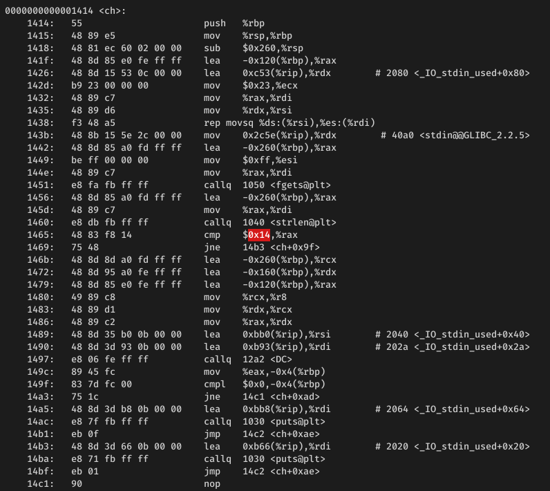

# C-Experiments

Experiments on C Exploits

## Environment

- 64 bit Linux Systems

## Completed Challenges

### - Dynamic (c)

- Loads string compare function on runtime
- Self modifies strlen comparison value
- Hides string using bit addition

### - Load (cpp)

- Loads compiled library file on runtime
- Loads string compare function from loaded library
- Hides string using XOR from templates

### - Rewrite (cc)

- Spawns/Clones secondary process for self modification
- Secondary process modifies /proc/{pid}/mem of primary process
- Hides string using bit addition

## Extras

### - Screwed (c)

- Corrupts ELF 64-bit or 32-bit headers with 0xffff values for e_shoff, e_shnum and e_shstrndx
- Binary is still able to be run normally, but crashes when debugged

## Methodology

### - Self Modification

1. MPROTECT and editing of value using C address pointer

    ```shell
    > objdump -d dynamic
    ```

    ### 

    Calculate address of value to overwrite, eg.

    ```C
    void *add = (void*)ch;
    unsigned char *ins = (unsigned char*)add + 84;
    *ins = 0x24;
    ```

    0x14 is overwritten as 0x24

    ```C
    if (strlen(sr)==20) => if (strlen(sr)==36)
    ```

2. Fork processes and editing of value within /proc/{pid}/mem

    Primary process pipes its information (pid, address and length of string to overwrite) to secondary process

    ```C
    int pipe1[2];
    int pipe2[2];
    int pipe3[2];
    pid_t f = fork();
    if (f == 0) {
        close(pipe1[1]);
        close(pipe2[1]);
        close(pipe3[1]);

        read(pipe1[0], addr_buf, 100);
        read(pipe2[0], length_buf, 100);
        read(pipe3[0], pid_buf, 100);
        // ...
    } else {
        close(pipe1[0]);
        close(pipe2[0]);
        close(pipe3[0]);

        // Calculate address, length of string and pid of process

        sprintf(addr_buf, "%lx", addr);
        sprintf(length_buf, "%lu", length);
        sprintf(pid_buf, "%d", pid);

        write(pipe1[1], addr_buf, strlen(addr_buf)+1);
        close(pipe1[1]);
        write(pipe2[1], length_buf, strlen(length_buf)+1);
        close(pipe2[1]);
        write(pipe3[1], pid_buf, strlen(pid_buf)+1);
        close(pipe3[1]);
        //...
    }
    ```

    Secondary process to use pid to read /proc/{pid}/mem and overwrite string at given address and length

    ```C
    strncpy(buf, new_string, *length_given);
    lseek(mem_file, *address, SEEK_SET);
    if (write(mem_file, buf, *length_given) == -1) {
        puts("Incorrect");
        return 1;
    }
    ```

    Temporary string s is overwritten with flag (First string s != Second string s)

    ```C
    printf("\nThe flag is \"%s\"!\n", s);
    puts("\nValidating......");
    sleep(1);
    if (!strcmp(s, inp)) {
        puts("Correct");
    } else {
        puts("Incorrect");
    }
    ```

### - Dynamically loaded functions

1. Load function from struct function list

    ```C
    // Struct to load function
    typedef struct functions{
        const char *function_name;
        TW address;
    } functions;

    // List of dynamic functions
    functions function_struct[] = {
        {"string_compare", &sc},
        {NULL, NULL}
    };

    // Compare called_function with function list, then load and run matched function
    int call_func(const char *called_function, const char* key, long* flag, long* buffer, char* input)
    {
        int k;
        for(k=0; function_struct[k].function_name != NULL; ++k){
            if(strcmp(called_function, function_struct[k].function_name) == 0){
                return function_struct[k].address(key, flag, buffer, input);
            }
        }
        return -1;
    }
    ```

    Calling "string_compare" on call_func() will compare with function list in function_struct, then is loaded and run when matched

    (One function is stored within the struct for simplicity)

2. Load function from self-created library

    ```C
    // Pipe for loaded function
    struct S {
        string input, flag;
        int output;
    };

    static const auto library = "\
        #include<stdlib.h>\n\
        #include<string>\n\
        struct S {std::string a,b;int i;};\n\
        extern \"C\" void F(S &s) {\n\
            if ((s.input.length()==0||\
            s.flag.length()==0)||\
            s.input.compare(s.flag)!=0||\
            s.input.length()!=s.flag.length())\
            {\n\
                s.output=1;\n\
                return;\n\
            }\n\
            s.output=0;}\n\
        ";
    create(library) // Create library using gcc

    void * function_library = load() // Load library
    if ( function_library ) {
        // Load function F from created library
        int ( *func ) ( S & ) = (int (*)( S & )) dlsym ( function_library, "F" );
    }
    ```

    Create its own library with hidden function on runtime, such that loaded function will not be shown during decompilation
