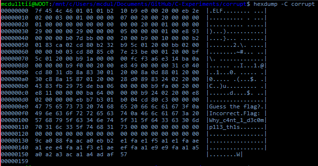
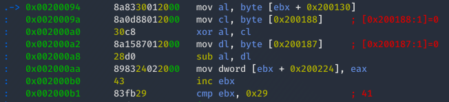
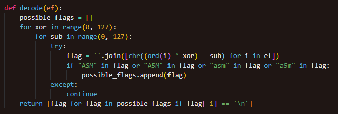

# Corrupt

## Solving

- Hexdump shows stored strings and data

- Tailer of executable shows print buffers and null bytes, followed by a hex array

- Hex array can be inferred to be the encoded output flag

### 

- Dynamic analysis of executable shows the executable receiving a string of less than 50 bytes

- Executable contained "Why_c4nt_1_d3c0mp1l3_th1s" as plain text string, which is the correct string input for the executable

- After inputting the correct string, the executable prints "Flag: W", which is the found hex array in the executable

- Hex array is encoded? The executable actually accepts a string input with more characters appended to the previous string input after 50 bytes

- Decompiling the hexdump of the binary shows one byte used as XOR, and another byte used as SUB

```asm
51: c0 80 cd db 31 83 8a    rol    BYTE PTR [eax-0x7cce2433],0x8a
58: 01 30                   add    DWORD PTR [eax],esi
5a: 00 20                   add    BYTE PTR [eax],ah
5c: 0d 8a 01 88 00          or     eax,0x88018a
61: 20 c8                   and    al,cl
63: 30 15 8a 01 87 00       xor    BYTE PTR ds:0x87018a,dl
69: 20 d0                   and    al,dl
6b: 28 83 89 02 24 00       sub    BYTE PTR [ebx+0x240289],al
71: 20 83 43 29 fb de       and    BYTE PTR [ebx-0x2104d6bd],al
77: 75 06                   jne    0x7f
```

- An easier method will be to use a dynamic disassembler, Radare2!

### 

- With trial and error, 2 bytes in the input are used in decoding the hex array, which are the 19th and 20th byte appended to the input string

- By brute forcing the pattern, since the flag string is printed with '\n', only one readable flag is found

(Code uses variations of "A5M" for faster elimination to obtain readable flags)

### 

## Workflow

- Collapsed ELF Headers

- Memory needs to be virtually allocated between 0x100000 and 0x800000 for executable to run

- Part of _main function within ELF magic header, replacing `times 9 db 0`

### 

- MPROTECT to change address permissions to readable and writable for stdin buffer to be read

### 

- Read from stdin and check if read

### 

- Compares key and input string with truncated length of key

### 

- Uses tailer 2 bytes of input string of certain length as XOR and SUB keys for decoding of flag

### 

- Prints decoded flag string no matter correct or wrong

### 

- Stored string and hex array for key and flag respectively

- Tailing `db 0`s for key buffer within .rodata section to hold XOR and SUB characters for decoding of flag

- Hex array of encoded flag stored within .data section

### 
