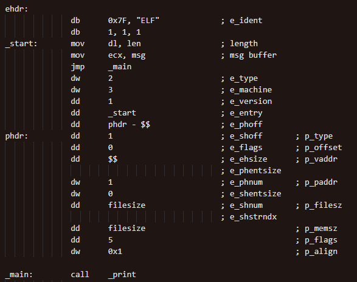
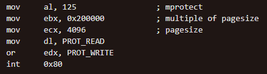
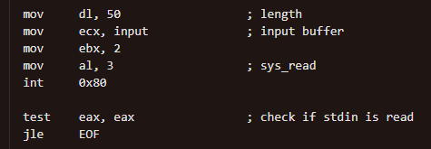
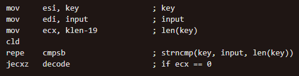
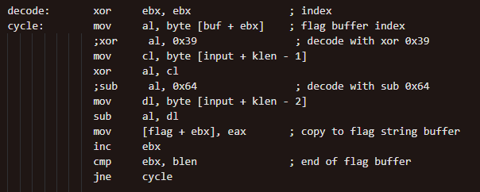
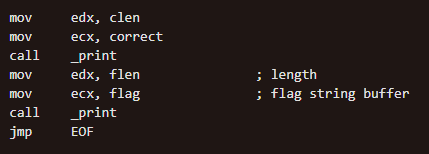
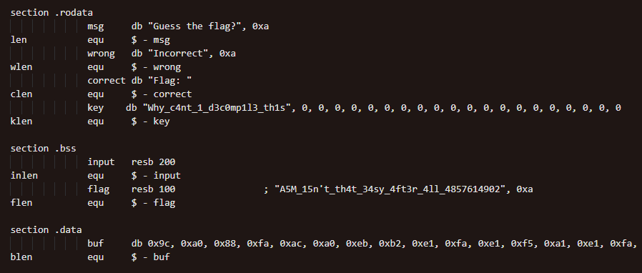

# Dynamic

## Solving

- TBC

## Workflow

- Collapsed ELF Headers

- Memory needs to be virtually allocated between 0x100000 and 0x800000 for executable to run

- Part of _main function within ELF magic header, replacing `times 9 db 0`

### 

- MPROTECT to change address permissions to readable and writable for stdin buffer to be read

### 

- Read from stdin and check if read

### 

- Compares key and input string with truncated length of key

### 

- Uses tailer 2 bytes of input string of certain length as XOR and SUB keys for decoding of flag

### 

- Prints decoded flag string no matter correct or wrong

### 

- Stored string and hex array for key and flag respectively

- Tailing `db 0`s for key buffer within .rodata section to hold XOR and SUB characters for decoding of flag

- Hex array of encoded flag stored within .data section

### 
