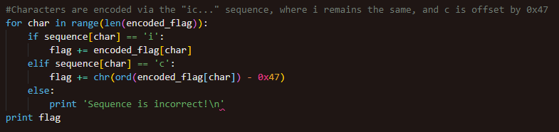
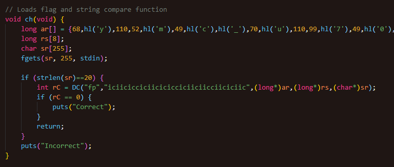

# Dynamic

## Solving

- Flag is 35 characters long, from the self modification

- Flag is encoded using the "ic..." sequence as key

### 

- Extract 35 rows of \x__ characters

- Characters with 'c' as key are bit subtracted by 0x47, while those with 'i' remain the same

- Decode characters using the above rule to obtain the flag

### 

## Workflow

- Change file permissions to RWX, then to X when exited

### 

- Check if binary is run by a debugger, then change strlen check in main() from 20 to 35

### 

- Decode string using bit subtraction, then call DC() to load function dynamically

### 

- Finds function name within struct, and loads the function with the corresponding name

### 

- Call loaded function to validate input string using ty as the index

### 
