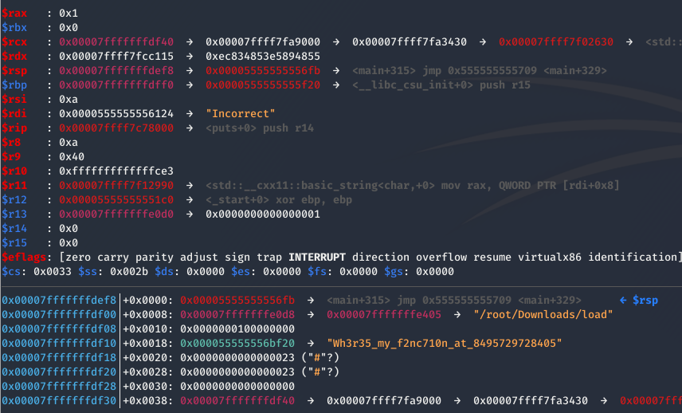
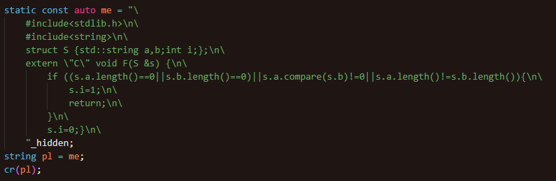

# Load

## Solving

- call sym dbp() is a function that detects breakpoints when the binary is run within a debugger

### 

- Overwrite jump instruction to skip GDB check

### 

- Use gdb to step through instructions till string compare function is called

- Stack is pushed to save the entire decoded flag when the loaded strcmp function is run, thus obtaining the flag

### 

## Workflow

- Strings are obfuscated via XOR, thus hidden from strings

### 

- Compile library within /tmp/ file to hide files during runtime

### 

- Load function within library

### 

- Call loaded function to validate input string

### 
