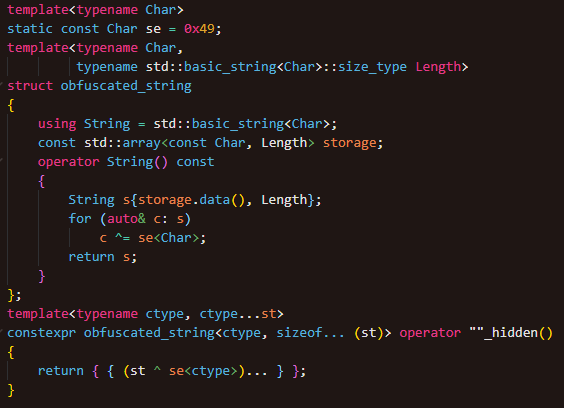
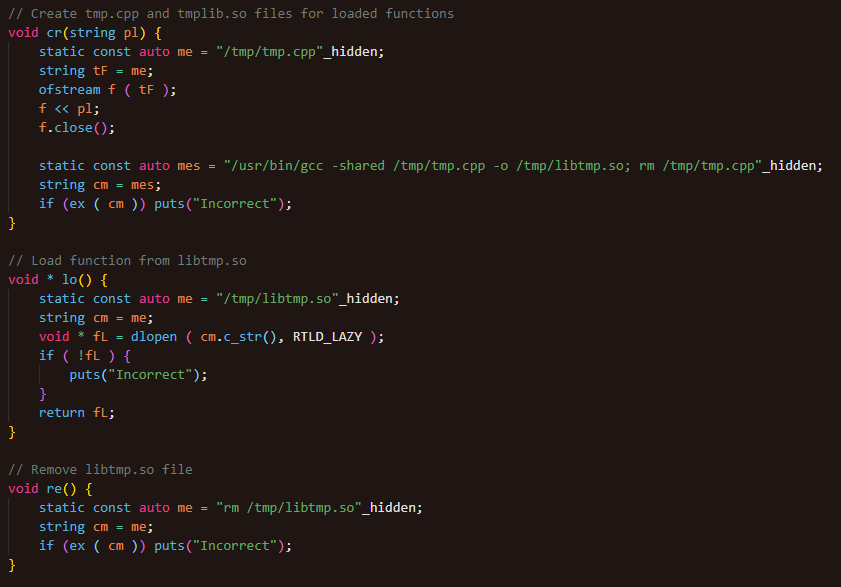
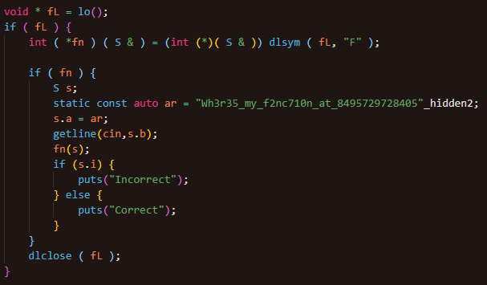

# Workflow

- Strings are obfuscated via XOR, thus hidden from strings

## 

- Compile library within /tmp/ file to hide files during runtime

## 

- Load function within library

## 

- Call loaded function to validate input string

## 
