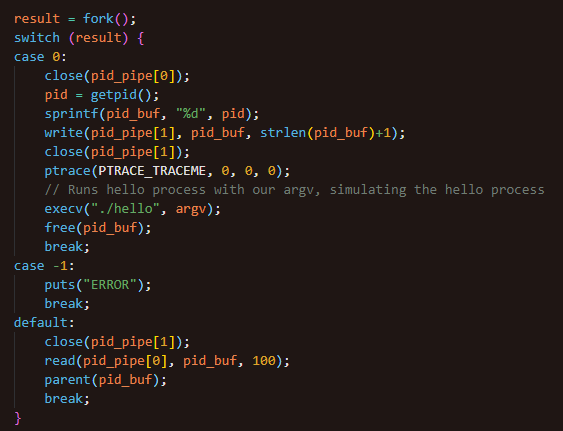
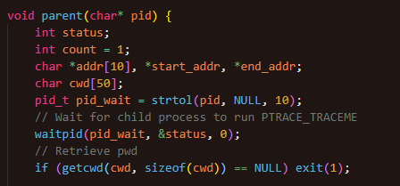
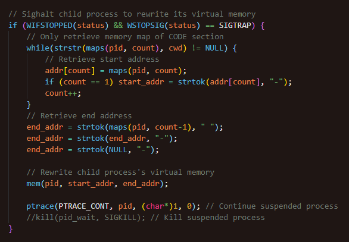
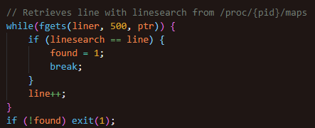
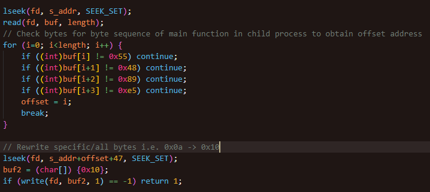

# ProcHollow

## Workflow

- Similar to Rewrite

- Spawns child process to execv hello binary in pwd

- PTRACE_TRACEME for parent process to halt child process

### 

- Wait to read pid from pipe from child process

### 

- SIGTRAP child process to edit its virtual memory

- Calculate start and end of memory addresses with pwd as string search, to only find Code sections in virtual memory of child process

### 

- Searches /proc/{pid}/maps by line

### 

- Reads /proc/{pid}/mem from start address of Code section

- Locates main function byte sequence to find offset

- Replaces printf value with 0x10

### 
