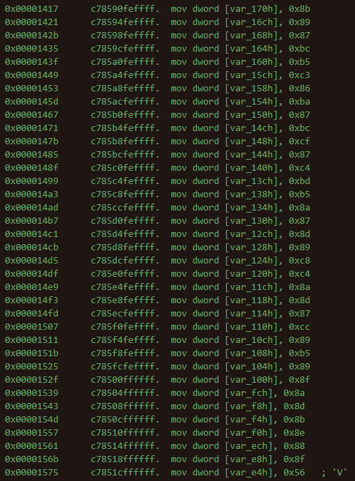
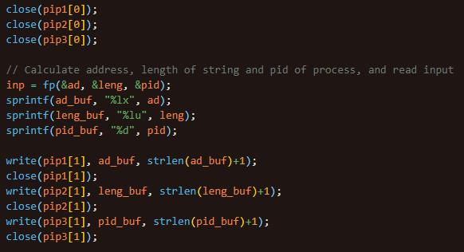
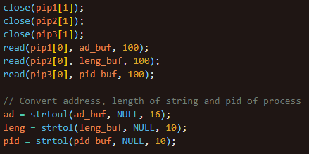
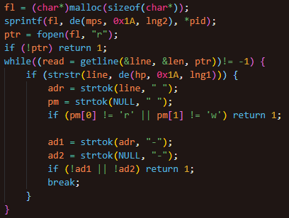
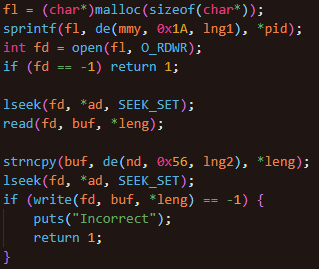
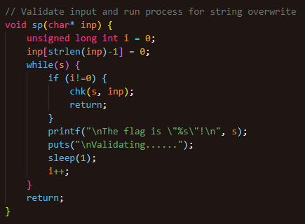
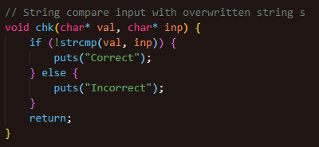

# Rewrite

## Solving

- Encoded strings loaded as int arrays

### 

- Encoded flag loaded as int array

### 

- Encoded strings can be split by the differences in opcodes
  - eg. c745________ is a different int array compared to c785________

- Encoded strings tailer are the NULL character, which are 0x1A for the strings, and 0x56 for the flag

- XOR or bit addition/subtraction can be used to identify which is the encoding method

- By trial and error, bit subtraction is found to be the decoding method, thus bit addition is the encoding method

### 

- Extract the last character before the \x00 characters from each instruction to obtain the characters to form each string

- Similar to the encoded strings, only the bit offset is different (0x56 instead of 0x1A), which obtains the flag

### 

## Workflow

- Strings are encoded via bit addition

### 

- Concatenate initial string s from char array

### 

- Fork process to thread functions

- Calculate pid, address and length of initial string, within the virtual memory of the primary process

- Write to pipe to transfer values to secondary process

### 

- Read from pipe and convert string values to integers

### 

- Secondary process to read /proc/{pid}/maps of primary process to ensure the heap of the primary process has the correct readable and writable permissions

### 

- Secondary process to read /proc/{pid}/mem of primary process, then overwrite a new string onto the same address of the initial string

### 

- Primary process prints the initial string, then parses the input string into the next string compare function while delaying for the secondary process to overwrite the initial string

### 

- Validates input string with overwritten string

### 
