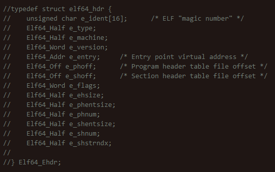
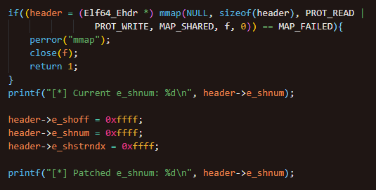

# Screwed

## Workflow

- Details of ELF 64-bit struct header

### 

- Certain struct values can be altered without affecting runtime
  - e_shoff
  - e_shnum
  - e_shstrndx

- Values are changed to 0xffff to corrupt ELF header

- Changes are made to corrupt ELF binary, thereby crashing gdb but maintaining the functions of the binary when run

### 

- ELF 32-bit struct header is similar, but requiring different address space for each value changed
